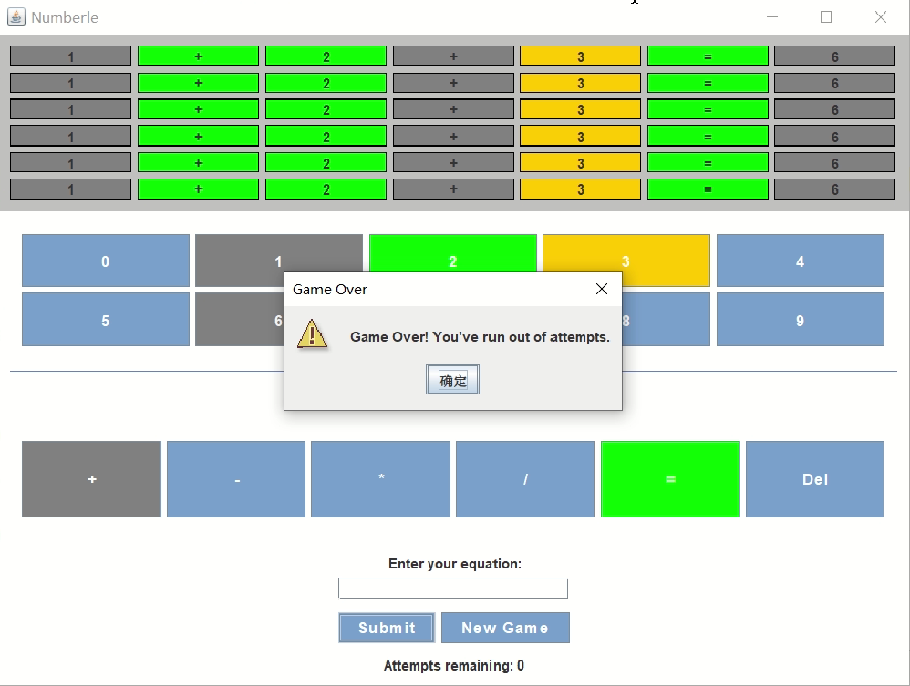
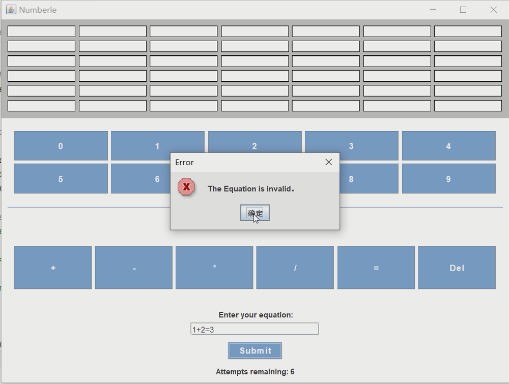
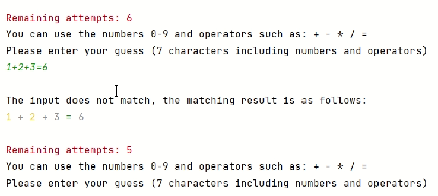
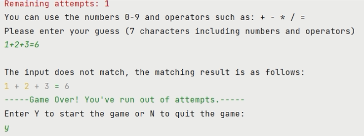

# Overview:
> Numberle is a mathematical wordle game where players must accurately guess a randomly generated equation within six attempts.  
> 
> Numberle game link: https://numberle.org/  

The project implements a 'Numberle' game using **Java** and **Swing**, which can be played in two ways:
1. GUI version (GUIAPP)
2. CLI(Command) version (CLIAPP)  

## UML Class Diagram:  
  

## Result: 
- GUI version:  
-   
-    

- CLI version:  
-   

-  